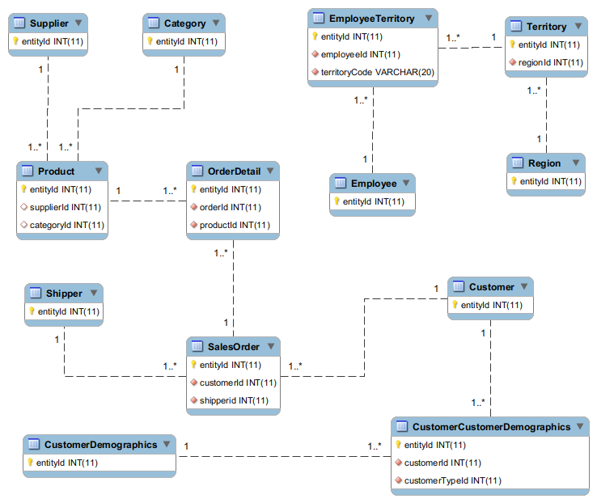

.Net Core EF demo
====

The demo project is re-create the well-known Northwind sample database with .Net Core Entity framework technology, aka EF Core.


### Pre-requisite

* .Net Core 2+
* .Net Core entity framework
* MySql 5.7+


### Development Env 

* Ubuntu. You can choose Windows or Mac
* IDE : Visual Studio Code


### ER Diagram

* The database is the same as my another repository [db](https://github.com/harryho/db-samples)

* Here I recap the ER diagram below




### Quick Start

#### Clone the project

```
git clone https://github.com/harryho/dotnet-core-ef.git

```

#### Update the database connection

* If you don't update the database name to something else instead of Northwind, you can simply change the name "Northwind" in the file appsetting.json

* E.g. You can change the name to NewDatabase as follow. Don't forget to replace user and password.

```json
{
  "connectionString": "Server=localhost;Database=NewDatabase;User=YourUserId;Password=YourPassword;"
  }
```

#### Create the Database via Code First

```bash
dotnet ef database --update 
```


### Recreate / Update Database via Code First approach


```bash
## Remove the database 
dotnet ef database drop --force

## Create an initial migration 
dotnet ef migrations add  --output-dir Data -p dotnet-demo-ef Initial


## To undo above action, use 
dotnet ef migrations remove

## Create the database
dotnet ef database update
```

#### Check out the migration version 


```sql
SELECT * FROM Northwind.__EFMigrationsHistory;
```

### Database reversing

Database reversing is not within the scope of this project, but it is a tool for schema design at the very early stage. You can refine the schema on the database and reverse the update to .net core project

#### Scaffold 

* Create a scaffolding code base from existing database, e.g. ExistingDatabase

```sh
dotnet ef dbcontext scaffold \
"Server=localhost;Database=ExistingDatabase;User=YourUserId;Password=YourPassword;" \
"Pomelo.EntityFrameworkCore.MySql"
```

#### Overwrite 


```sh
# Reverse the whole database
dotnet ef dbcontext scaffold --force --output-dir ReverseDBSchema \
"Server=localhost;Database=ExistingDatabase;User=YourUserId;Password=YourPassword;" \
"Pomelo.EntityFrameworkCore.MySql"

# Reverse the some tables 
dotnet ef dbcontext scaffold --force  --output-dir ReverseDBSchema \
"Server=localhost;Database=ExistingDatabase;User=YourUserId;Password=YourPassword;" \
"Pomelo.EntityFrameworkCore.MySql" --tables table_001 table_002

```

